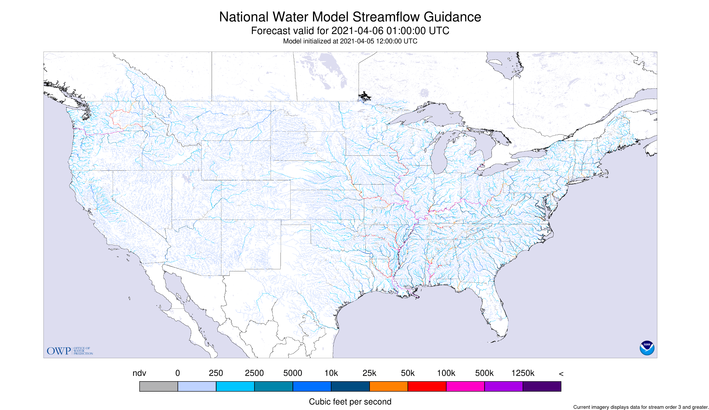
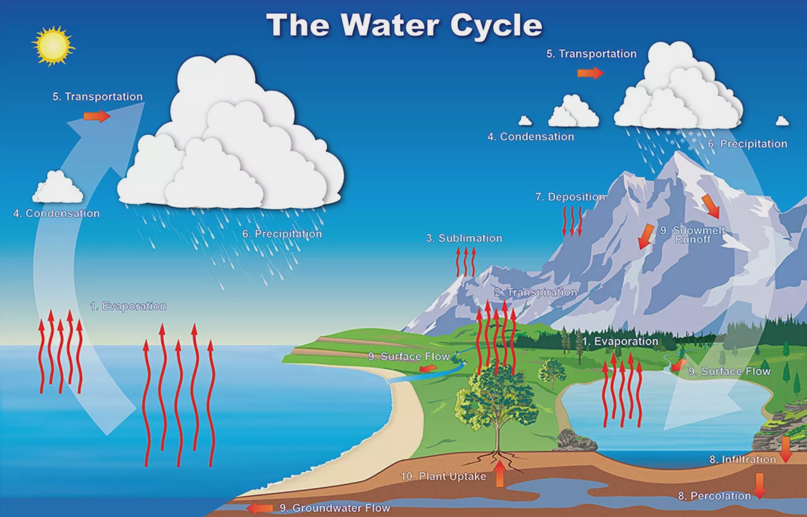
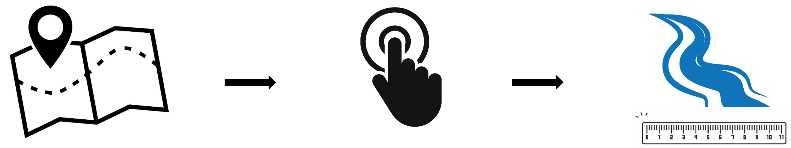

```{css, eval = TRUE, echo = FALSE}
.remark-code{line-height: 2; font-size: 60%}
```
```{r, include = F}
knitr::opts_chunk$set(fig.width = 8, message = FALSE, warning = FALSE, comment = "", cache = FALSE, fig.retina = 3)
library(flipbookr)
library(tidyverse)
library(cowplot)
library(ggplot2)
library(highcharter)
library(dataRetrieval)
library(climateR)

precip <- readRDS("../docs/precip2.rds")
evap <- readRDS("../docs/evap2.rds")
nwm <- readRDS("../docs/nwm.rds")

flowline <- findNLDI(location = c(-94.64, 31.09))
pt <- sf::st_centroid(flowline)

graph_climateR <- function(df1, df2) {
    highchart() %>%
      hc_yAxis_multiples(list(title = list(text = "Accumulated Precipitation (mm)"),
                            min=0,
                            max = max(df1$prcp),
                            showFirstLabel = TRUE,
                            showLastLabel = TRUE,
                            opposite = FALSE),
                         list(title = list(text = "Actual Evapotranspiration (mm)"),
                            showLastLabel=FALSE,
                            opposite = TRUE)) %>%
      hc_add_series(df1, name = "Precipitation", type = "column",
                    hcaes(x = date, y = prcp), yAxis = 1 ) %>%
      hc_add_series(df2, name = "Evaporation", type = "line",
                    hcaes(x = date, y = aet), yAxis = 0) %>%
      hc_colors(c("darkcyan", "darkred")) %>% 
          hc_xAxis(categories = df1$date) 
}


graph_NWM <- function(df) {
    highchart() %>%
      hc_add_series(df, name = "Streamflow", type = "column",
                    hcaes(x = date, y = vpd)) %>%
      hc_colors("darkcyan") %>% 
      hc_xAxis(categories = df$date) %>% 
      hc_yAxis(title = list(text = "Discharge (m³/s)"))
}

# p1 <- ggdraw() + draw_image("map-icon.jpg", scale = 0.9)
# p2 <- ggdraw() + draw_image("arrow-icon.png", scale = 0.9)
# p3 <- ggdraw() + draw_image("click-icon.jpg", scale = 0.9)
# p4 <- ggdraw() + draw_image("arrow-icon.png", scale = 0.9)
# p5 <- ggdraw() + draw_image("river2-icon.png", scale = 0.9)
# 
# pics <- plot_grid(p1, p2, p3, p4, p5, nrow = 1)
```

# **R Shiny streamflow application**
<center>
```{r, echo = FALSE,  out.width = "85%"}

```
</center>
---

# **The National Water Model (NWM)**
<center>
- The National Water Model (NWM) project uses USGS stream gauges to simulate the water cycle processes using  mathematical representations for different processes to see how the processes fit together.

<br>
<br>

```{r, echo = FALSE,  out.width = "65%"}

```
</center>


---

# **Problem**
There is **NOT** an easy way to view simultaneously view catchments + stream flow data 


--

# **Solution**
- Create a ***R Shiny dashboard*** that allows the user to explore all watershed catchments in the US and get on demand streamflow data

```{r, echo = FALSE,  out.width = "98%"}

```

---

# **Research questions**

--

**1. What is the relative impact of certain geographic factors on stream flows?**

--
  - Proximity to a dam, population density, land cover

--

<br>

**2. Forecast stream flow rates using precipitation and water withdrawals in a multilayer perceptron Machine learning algorithm**

---

# **Data sources**

--

- Project and data retrieval will use these **R packages**:
  - `tidyr`
  - `dplyer`
  - `sf`
  - `leaflet`
  - `dataRetrieval`
  - `nhdplusTools`
  - `nwmTools`
  - `shiny`
  
---
`r flipbookr::chunk_reveal("nldi", title = "# Find flowline from map click")`
```{r nldi, include=FALSE}
library(dataRetrieval)

# R Client for the Network Linked Data Index
flowline <- findNLDI(location = c(-94.64, 31.09))
flowline 

```

---

`r flipbookr::chunk_reveal("nhd", title = "# Find catchment polygons from COMID")`
```{r nhd, include = FALSE}
library(nhdplusTools)

# Get catchment polygons from National Hydrography Dataset V2 Subsets 
catchment <- get_nhdplus(comid = flowline$comid, 
                   realization = "catchment")
catchment

```

---

`r flipbookr::chunk_reveal("interactive", title = "# View catchments in leaflet")`
```{r interactive, include = FALSE}
library(leaflet)

leaflet() %>% 
  addProviderTiles(providers$Esri.WorldTopoMap) %>% 
  setView(-94.64, 31.09, 13) %>%  
  addPolygons(data = catchment,
              color = "green") %>% 
  addPolylines(data = flowline,
               color = "red",
               opacity = 1) 
```

---


`r flipbookr::chunk_reveal("nwm", title = "# NWM data using nwmTools package")`

```{r nwm, include = FALSE, error=TRUE, eval = FALSE}
library(nwmTools)

# Retrieve flow data from NWM via COMID

# nwm <- nwmTools::readNWMdata(comid = 101)
graph_NWM(nwm)
```
---

`r flipbookr::chunk_reveal("climate", title = "# Climate data using climateR package")`

```{r climate, include = FALSE, out.width=9}
library(climateR)
library(sf)
library(highcharter)

# Retrieve climate data for the catchment using centroid point
pt <- st_centroid(flowline)

# precip <- getTerraClim(AOI = pt, param = "prcp", startDate = "2011-01-01", endDate = "2014-01-01")
# evap <- getTerraClim(AOI = pt, param = "aet", startDate = "2011-01-01", endDate = "2014-01-01")

graph_climateR(precip, evap)
```
---
# Contact info

- **email:** adwattersgrubstein@ucsb.edu

- **GitHub:** https://github.com/anguswg-ucsb


--

- Thanks for your time !

--

---

